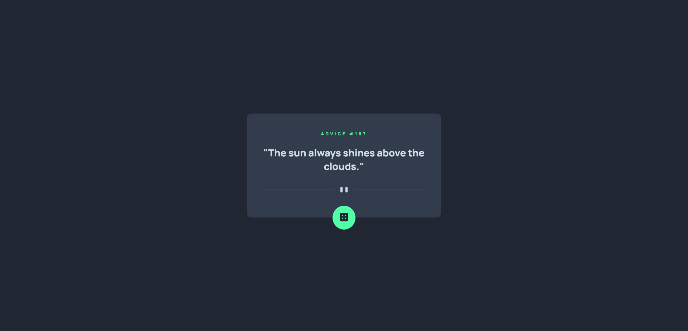
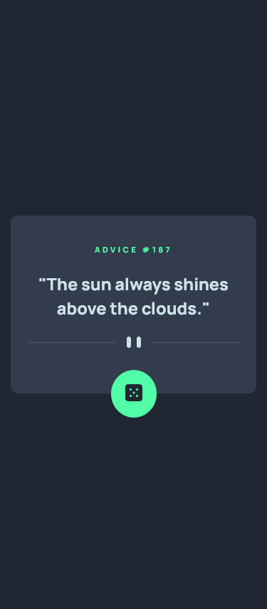

# Frontend Mentor - Advice generator app solution

This is a solution to the [Advice generator app challenge on Frontend Mentor](https://www.frontendmentor.io/challenges/advice-generator-app-QdUG-13db). Frontend Mentor challenges help you improve your coding skills by building realistic projects.

## Table of contents

- [Overview](#overview)
  - [The challenge](#the-challenge)
  - [Screenshot](#screenshot)
  - [Built with](#built-with)
  - [Live Page](#LivePage)
- [Author](#author)

## Overview

### The challenge

Challenge is to build out this advice generator app using the [Advice Slip API](https://api.adviceslip.com) and get it looking as close to the design as possible.

Your users should be able to:

- View the optimal layout for the app depending on their device's screen size
- See hover states for all interactive elements on the page
- Generate a new piece of advice by clicking the dice icon

### Links

- Solution URL: [GitHub](https://github.com/AlanDavid-007/Advice-Generator-App)

### Built with

- HTML5
- SASS
- CSS
- JS
###LivePage
https://alandavid-007.github.io/Advice-Generator-App/
## Author

- Frontend Mentor - [#MyProfile](https://www.frontendmentor.io/profile/AlanDavid-007)

### Screenshot

